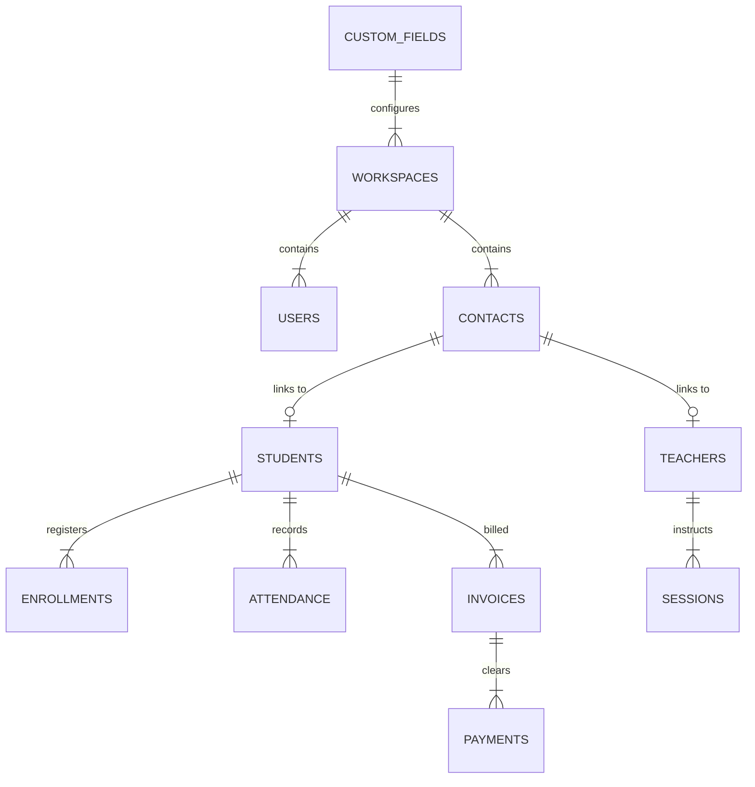

# Madrasa Management System (MMS) — Platform Architectural Review & Blueprint

An enterprise-ready technical blueprint and architectural review of the Madrasa Management System monorepo, detailing system design, multi-tenant context propagation, database schema, security framework, state management, frontend UI/UX architecture, shared domain packages, background job queues, and deployment infrastructure across [`apps/frontend`](file:///Users/syedaalin/Documents/mms/apps/frontend), [`apps/backend`](file:///Users/syedaalin/Documents/mms/apps/backend), and [`packages/shared`](file:///Users/syedaalin/Documents/mms/packages/shared).

---

## Executive Summary & Architectural Enhancements

| Architectural Pillar | Original Blueprint | Enhanced Best Practice (Upgraded) | Key Benefit |
| --- | --- | --- | --- |
| **Context Propagation** | Manual parameter passing | Node.js `AsyncLocalStorage` (`TenantContext`) | Eliminates prop-drilling of tenant headers across service and repository layers. |
| **Background Processing** | Custom SQL `FOR UPDATE SKIP LOCKED` polling | `pg-boss` / Redis-backed queue engine with DLQ | Guarantees job retries, backoff strategies, idempotency, and dead-letter queues. |
| **Dynamic Form System** | Unindexed `JSONB` storage | `JSONB` GIN indexing (`jsonb_path_ops`) + `drizzle-zod` | Prevents full table scans on custom fields and guarantees end-to-end schema DRYness. |
| **WebSocket Scaling** | Single-instance server state | Fastify WS with Redis Pub/Sub adapter | Enables multi-node / PM2 cluster scale-out for real-time cache invalidation. |
| **Containerization & Deployment** | Bare-metal host with PM2 process manager | Docker multi-stage builds + Nginx SPA sidecar | Container isolation, reproducible builds, and zero-downtime rolling deployments. |
| **RTL & Typography** | Global `dir="rtl"` attribute toggle | Script-aware dynamic font family loader | Ensures native typography rendering for Nastaliq (Urdu) and Naskh/Cairo (Arabic). |

---

## 1. Monorepo Blueprint & Technology Stack

The platform utilizes a **pnpm workspace** paired with **Turborepo** for build orchestration, task caching, and package boundary enforcement.

```
mms/
├── apps/
│   ├── frontend/         # React 19 + Vite 8 SPA Client
│   └── backend/          # Fastify 5 + Drizzle ORM + Node-Postgres API Server
├── packages/
│   └── shared/           # @mms/shared — SSOT Schemas, Types, Utilities, Manifests
├── .agent/               # Antigravity agent skills, rules, and workflows
├── turbo.json            # Monorepo pipeline & remote build cache rules
├── docker-compose.yml    # Infrastructure orchestration (Postgres, Redis, App)
└── Platform.md           # Monorepo Architectural Blueprint (this file)
```

### Core Stack Specifications

| Domain | Technology / Library | Purpose & Enterprise Best Practice |
| --- | --- | --- |
| **Backend Runtime** | Node.js (≥24.14 LTS), Fastify 5 | High-throughput runtime; Fastify 5 encapsulation and strict plugin isolation. |
| **Context Store** | Node.js `AsyncLocalStorage` | Thread-safe propagation of tenant and user context across asynchronous request chains. |
| **Backend ORM** | Drizzle ORM + `pg` client pool | Type-safe SQL builder with explicit transaction wrappers for Row-Level Security (RLS). |
| **Background Queues** | `pg-boss` / BullMQ | Production-grade async job execution with exponential backoff and retry tracking. |
| **Frontend Framework** | React 19 + Vite 8 | Concurrent rendering, `use` hook, Suspense boundaries, and module-level code splitting. |
| **State & Data Layer** | TanStack Query v5 + WebSockets | Query key factories, optimistic UI updates, and real-time push invalidations via Redis. |
| **Design System** | Tailwind CSS v4 + Radix UI / shadcn | Surface tokens via dynamic CSS variables, automated WCAG contrast verification. |
| **Shared Domain** | `@mms/shared` (TypeScript) | Zero-trust Zod `.strict()` validation schemas shared seamlessly across FE and BE. |
| **Animations & Visuals** | Framer Motion & Recharts | Micro-interactions, animated drawers/modals, responsive charting and analytics visuals. |
| **Localization (i18n)** | `appTranslations.ts` (en/ar/ur/fa) | Multi-language engine with script-aware font loader and native RTL layout mirroring. |

---

## 2. Multi-Tenant Architecture & Context Propagation

MMS provides enterprise-grade multi-tenancy backed by PostgreSQL Row-Level Security (RLS) and automatic tenant context injection.

```
[ HTTP Request ] ──► [ Fastify Subdomain Middleware ]
                           │
                           ▼ Sets Tenant Context
                 [ AsyncLocalStorage Store ]
                           │
                           ▼ Propagates Automatically
              [ Drizzle RLS Transaction Wrapper ]
                           │
                           ▼ SET LOCAL app.current_tenant_id = 'tenant_slug'
                 [ PostgreSQL Engine (RLS) ]
```

### 2.1 AsyncLocalStorage Context Propagation Engine

Instead of explicitly passing `tenantId` through every service layer function, the backend leverages Node.js `AsyncLocalStorage` via `tenantContext.ts`:

```typescript
// context/tenantContext.ts
import { AsyncLocalStorage } from 'node:async_hooks';

export interface TenantStore {
  workspaceSubdomain: string;
  userId?: string;
  role?: string;
}

export const tenantStorage = new AsyncLocalStorage<TenantStore>();

export function getTenantContext(): TenantStore {
  const store = tenantStorage.getStore();
  if (!store) {
    throw new Error('CRITICAL: Attempted database or service execution outside Tenant Context.');
  }
  return store;
}
```

### 2.2 Subdomain Routing Engine

1. **Subdomain Resolution**: [`tenantSubdomainUtils.ts`](file:///Users/syedaalin/Documents/mms/packages/shared/src/tenantSubdomainUtils.ts) extracts the subdomain slug from incoming HTTP host headers (`{subdomain}.${MMS_APP_DOMAIN}`).
2. **Platform Apex vs. Tenant App**: Requests to `platform.*` or the root domain route to the platform management UI, while tenant subdomains bound request execution to a specific madrasa workspace.
3. **Tenant Boot Gate (`TenantBootGate`)**: [`TenantRoutes.tsx`](file:///Users/syedaalin/Documents/mms/apps/frontend/src/tenant/routes/TenantRoutes.tsx) verifies workspace existence and enablement (`workspace.enabled !== false`). Inactive workspaces trigger `WorkspaceDisabledScreen`, and invalid subdomains redirect to the platform domain.

### 2.3 PostgreSQL Row-Level Security (RLS) & Connection Safety

When using connection poolers (e.g., PgBouncer), setting session variables can spill across queries if not scoped strictly to a single transaction using `SET LOCAL`.

```sql
-- RLS Policy Configuration
ALTER TABLE students ENABLE ROW LEVEL SECURITY;
ALTER TABLE students FORCE ROW LEVEL SECURITY;

CREATE POLICY tenant_isolation_policy ON students
  FOR ALL
  USING (workspace_subdomain = current_setting('app.current_tenant_id', true))
  WITH CHECK (workspace_subdomain = current_setting('app.current_tenant_id', true));
```

```typescript
// db/withTenantTransaction.ts
import { db } from './dbConnection';
import { tenantStorage } from '../context/tenantContext';
import { sql } from 'drizzle-orm';

export async function withTenantTransaction<T>(
  callback: (tx: Parameters<Parameters<typeof db.transaction>[0]>[0]) => Promise<T>
): Promise<T> {
  const { workspaceSubdomain } = tenantStorage.getStore() || {};
  
  if (!workspaceSubdomain) {
    throw new Error('Tenant context missing. Aborting database operation.');
  }

  return await db.transaction(async (tx) => {
    // Scope variable strictly to the current transaction
    await tx.execute(sql`SET LOCAL app.current_tenant_id = ${workspaceSubdomain}`);
    return await callback(tx);
  });
}
```

---

## 3. Backend Architecture & Background Queues

### 3.1 Modular Plugin Hierarchy

The Fastify backend initializes cleanly through isolated plugins ([`app.ts`](file:///Users/syedaalin/Documents/mms/apps/backend/src/app.ts)):

```
Fastify Root Instance
 ├── securityPlugin     (Helmet, CORS, Rate Limiting, CSRF)
 ├── tenantContextPlugin (Extracts subdomain, validates tenant, populates AsyncLocalStorage)
 ├── authPlugin          (JWT verify, 2FA validation, RBAC capability check)
 └── apiRoutes           (Mounted under /api/v1)
```

### 3.2 Production Job Engine (`pg-boss`)

To prevent database overhead caused by continuous raw table polling, MMS utilizes **`pg-boss`**—a production-grade job queue built on PostgreSQL transaction isolation:

```typescript
// jobs/queueEngine.ts
import PgBoss from 'pg-boss';
import { tenantStorage } from '../context/tenantContext';

export const boss = new PgBoss(process.env.DATABASE_URL!);

export async function initJobEngine() {
  await boss.start();
  
  // Register Job Workers
  await boss.work('GENERATE_PDF_REPORT', async ([job]) => {
    const { workspaceSubdomain, reportParams } = job.data;
    // Process job within explicit tenant context
    await tenantStorage.run({ workspaceSubdomain }, async () => {
      await generateReportPdf(reportParams);
    });
  });
}
```

### 3.3 Backend API Taxonomy

```
/api/
├── v1/
│   ├── platform/            # Super-Admin APIs (Provisioning, Billing, System Stats)
│   │   ├── auth.ts
│   │   ├── workspaces.ts
│   │   └── metrics.ts
│   └── tenant/              # Tenant Madrasa APIs (Authenticated via JWT & RLS)
│       ├── contacts.ts
│       ├── students.ts
│       ├── teachers.ts
│       ├── enrollments.ts
│       ├── sessions.ts
│       ├── attendance.ts
│       ├── finance.ts
│       ├── accounting.ts
│       ├── hasanat.ts
│       ├── examinations.ts
│       ├── questionBank.ts
│       ├── obligations.ts
│       ├── messaging.ts
│       ├── users.ts
│       ├── savedReports.ts
│       └── customTabs.ts
├── ws                       # Real-Time WebSocket Channel (Query Invalidation Push)
└── uploads/                 # Authenticated Media & File Upload Handler
```

---

## 4. Database Schema & Dynamic Form System (DFS)

### 4.1 Core Relational Entities



### 4.2 Indexing Strategy for Dynamic JSONB Attributes

To allow fast lookups and filtering on custom dynamic attributes without full table scans, JSONB fields utilize **GIN indexing** (`jsonb_path_ops`):

```sql
-- Schema Migration for High-Performance DFS Queries
CREATE INDEX idx_contacts_custom_attrs_gin 
ON contacts USING gin (custom_attributes jsonb_path_ops);

CREATE INDEX idx_students_tenant_id 
ON students (workspace_subdomain, id);
```

### 4.3 Single Source of Truth (SSOT) Schema Construction

Drizzle schema definitions automatically generate Zod validation schemas using `drizzle-zod`, preventing schema drift between the database and the frontend:

```typescript
// packages/shared/src/schemas/student.ts
import { pgTable, text, timestamp, uuid } from 'drizzle-orm/pg-core';
import { createInsertSchema, createSelectSchema } from 'drizzle-zod';

export const students = pgTable('students', {
  id: uuid('id').primaryKey().defaultRandom(),
  workspaceSubdomain: text('workspace_subdomain').notNull(),
  fullName: text('full_name').notNull(),
  enrollmentNumber: text('enrollment_number').notNull(),
  createdAt: timestamp('created_at').defaultNow().notNull(),
});

export const insertStudentSchema = createInsertSchema(students).omit({
  id: true,
  createdAt: true,
});
```

---

## 5. Frontend UI/UX & State Architecture

### 5.1 Three-Tier Universal Module Architecture

Every functional feature (Students, Finance, Contacts, etc.) follows a consistent three-tier layout structure ([`mms-module-architecture.md`](file:///Users/syedaalin/Documents/mms/.agent/rules/mms-module-architecture.md)):

```
┌───────────────────────────────────────────────────────────────────────────┐
│ Module Header: Title, Real-time Metrics, Global Search, Action Bar         │
├──────────────────────────────────────┬────────────────────────────────────┤
│ 📊 Tier 1: Work (Command Centre)     │ Primary Data Grid, Quick Drawers   │
│ 📈 Tier 2: Reports (Analytics)       │ Interactive Recharts, Export Engine│
│ ⚙️ Tier 3: Setup (Custom Fields)     │ Drag-and-Drop Registry & Prefs     │
└──────────────────────────────────────┴────────────────────────────────────┘
```

1. **Tier 1: Work (Command Centre)**
   - Metric summary cards displaying key operational KPIs.
   - Filterable data table and grid views with column visibility toggles.
   - Detail sliding drawers for fast entity inspection.
   - Soft-delete Trash Drawer with record restoration and purge capability.
2. **Tier 2: Reports (Analytics & Exports)**
   - Interactive charts built with Recharts.
   - Custom Report Builder for query filtering and saved report configurations.
   - Standardized Export Toolbar (PDF generation, Excel `.xlsx`, CSV, print formats).
3. **Tier 3: Setup (Configuration & Fields)**
   - Fields Sub-Tab: Drag-and-drop field reordering, system tab visibility toggles, custom field creation via [`CustomFieldsBuilder.tsx`](file:///Users/syedaalin/Documents/mms/apps/frontend/src/components/dynamic-form/CustomFieldsBuilder.tsx).
   - Preferences Sub-Tab: Module-specific behavioral settings and automated rules.
   - Setup Audit Sub-Tab: Log of field and preference modifications over time.

### 5.2 State Management & WebSocket Invalidation

TanStack Query manages server state while WebSocket connections trigger real-time cache updates:

```typescript
// frontend/src/hooks/useRealtimeSync.ts
import { useEffect } from 'react';
import { useQueryClient } from '@tanstack/react-query';

export function useRealtimeSync(workspaceSubdomain: string) {
  const queryClient = useQueryClient();

  useEffect(() => {
    const ws = new WebSocket(`${import.meta.env.VITE_WS_URL}?tenant=${workspaceSubdomain}`);

    ws.onmessage = (event) => {
      const { entity, action } = JSON.parse(event.data);
      // Targeted cache invalidation based on entity push notification
      queryClient.invalidateQueries({ queryKey: [entity] });
    };

    return () => ws.close();
  }, [workspaceSubdomain, queryClient]);
}
```

### 5.3 Dynamic Script-Aware RTL & Typography Engine

The frontend changes typography dynamically depending on whether the selected language uses Naskh (Arabic) or Nastaliq (Urdu):

```tsx
// frontend/src/components/LanguageProvider.tsx
import React, { useEffect } from 'react';

const FONT_MAP = {
  ur: 'font-nastaliq', // Noto Nastaliq Urdu
  ar: 'font-cairo',    // Cairo / Amiri
  en: 'font-sans',     // Inter / Plus Jakarta Sans
  fa: 'font-vazirmatn' // Vazirmatn
};

export function applyLanguageSettings(lang: 'en' | 'ar' | 'ur' | 'fa') {
  const isRtl = ['ar', 'ur', 'fa'].includes(lang);
  document.documentElement.dir = isRtl ? 'rtl' : 'ltr';
  document.documentElement.lang = lang;
  
  // Update body font class dynamically
  document.body.className = FONT_MAP[lang] || FONT_MAP.en;
}
```

---

## 6. Security, Authentication & Audit Logging

### 6.1 Authentication Lifecycle

- **Short-Lived Access Tokens**: 15-minute expiration passed via `Authorization: Bearer` or secure HttpOnly cookies.
- **Refresh Token Rotation**: Stored in a strict HttpOnly cookie with automatic token family revocation upon reuse detection.
- **Role-Based Access Control (RBAC)**: Centralized permission evaluation defined in [`permissions.ts`](file:///Users/syedaalin/Documents/mms/packages/shared/src/permissions.ts):

```typescript
// packages/shared/src/permissions.ts
export type Role = 'super_admin' | 'admin' | 'teacher' | 'accountant' | 'staff';

export const CAPABILITIES = {
  'students:create': ['super_admin', 'admin'],
  'students:read': ['super_admin', 'admin', 'teacher', 'accountant', 'staff'],
  'finance:write': ['super_admin', 'admin', 'accountant'],
} as const;

export function hasCapability(role: Role, capability: keyof typeof CAPABILITIES): boolean {
  return (CAPABILITIES[capability] as readonly Role[])?.includes(role) ?? false;
}
```

### 6.2 Cryptographic Audit Logging

Financial transactions, grade modifications, and system configuration updates append an immutable record to the `audit_logs` table with SHA-256 hash chaining to guarantee tamper resistance.

---

## 7. Feature Modules Deep-Dive

The platform encapsulates comprehensive functionality across 18 specialized modules:

| Module | Core Purpose & Features | Key Components & Files |
| :--- | :--- | :--- |
| **Dashboard** | Executive overview with configurable KPI cards, enrollment trends, attendance summary, quick action shortcuts. | [`DashboardPage.tsx`](file:///Users/syedaalin/Documents/mms/apps/frontend/src/tenant/features/dashboard/DashboardPage.tsx) |
| **Contacts** | Primary identity engine for all individuals (parents, guardians, staff). Manages duplicate detection and vCard exports. | [`ContactsPage.tsx`](file:///Users/syedaalin/Documents/mms/apps/frontend/src/tenant/features/contacts/ContactsPage.tsx) |
| **Students** | Student lifecycle management, academic profiles, guardian linkage, document attachments, and registration flows. | [`StudentsPage.tsx`](file:///Users/syedaalin/Documents/mms/apps/frontend/src/tenant/features/students/StudentsPage.tsx) |
| **Teachers** | Staff management, teaching assignments, workload tracking, qualification records, and contact sync. | [`TeachersPage.tsx`](file:///Users/syedaalin/Documents/mms/apps/frontend/src/tenant/features/teachers/TeachersPage.tsx) |
| **Enrollments** | Student class/grade placements, academic year promotions, enrollment history, and transfer tracking. | [`EnrollmentsPage.tsx`](file:///Users/syedaalin/Documents/mms/apps/frontend/src/tenant/features/enrollments/EnrollmentsPage.tsx) |
| **Sessions** | Class timetables, session scheduling, subject definitions, and classroom allocation. | [`SessionsPage.tsx`](file:///Users/syedaalin/Documents/mms/apps/frontend/src/tenant/features/sessions/SessionsPage.tsx) |
| **Attendance** | Daily and session-level attendance recording, bulk marking, absence alerts, and monthly aggregates. | [`AttendancePage.tsx`](file:///Users/syedaalin/Documents/mms/apps/frontend/src/tenant/features/attendance/AttendancePage.tsx) |
| **Finance** | Student billing, fee structures, invoice generation, payment receipting, discount management, balance tracking. | [`FinancePage.tsx`](file:///Users/syedaalin/Documents/mms/apps/frontend/src/tenant/features/finance/FinancePage.tsx) |
| **Accounting** | General Ledger (GL), double-entry vouchers (Journal, Cash, Bank), chart of accounts, financial statements. | [`AccountingPage.tsx`](file:///Users/syedaalin/Documents/mms/apps/frontend/src/tenant/features/accounting/AccountingPage.tsx) |
| **Hasanat Cards** | Student merit and character tracking, behavior cards, achievement points, and positive reinforcement logging. | [`HasanatCardsPage.tsx`](file:///Users/syedaalin/Documents/mms/apps/frontend/src/tenant/features/hasanat/HasanatCardsPage.tsx) |
| **Examinations** | Exam scheduling, mark sheets, grade rules, report cards, GPA calculations, and student transcripts. | [`ExaminationsPage.tsx`](file:///Users/syedaalin/Documents/mms/apps/frontend/src/tenant/features/examinations/ExaminationsPage.tsx) |
| **Question Bank** | Exam question repository, subject taxonomy, question difficulty levels, answer keys, source citations. | [`QuestionBankPage.tsx`](file:///Users/syedaalin/Documents/mms/apps/frontend/src/tenant/features/question-bank/QuestionBankPage.tsx) |
| **Obligations** | Student tasks, memorization tracking (Hifz/Nazra), behavioral commitments, and progress verification. | [`ObligationsPage.tsx`](file:///Users/syedaalin/Documents/mms/apps/frontend/src/tenant/features/obligations/ObligationsPage.tsx) |
| **Messaging** | Multi-channel communication (SMS & WhatsApp), template composer, variable hydration, delivery logging. | [`MessagingPage.tsx`](file:///Users/syedaalin/Documents/mms/apps/frontend/src/tenant/features/messaging/MessagingPage.tsx) |
| **Users & RBAC** | User account management, custom role creation, granular permission assignment, session termination. | [`UsersPage.tsx`](file:///Users/syedaalin/Documents/mms/apps/frontend/src/tenant/features/users/UsersPage.tsx) |
| **Profile** | User profile preferences, security settings, 2FA setup, active sessions, and password change. | [`AccountProfilePage.tsx`](file:///Users/syedaalin/Documents/mms/apps/frontend/src/tenant/features/profile/AccountProfilePage.tsx) |
| **Settings** | Madrasa workspace profile, branding customizer, global preferences, translation overrides, backup/restore. | [`SettingsPage.tsx`](file:///Users/syedaalin/Documents/mms/apps/frontend/src/tenant/features/settings/SettingsPage.tsx) |

---

## 8. Background Processing & Messaging Engine

### 8.1 Background Job Architecture (`pg-boss`)

Large workloads execute asynchronously outside the primary HTTP request/response cycle using `pg-boss` or custom PostgreSQL job queues.

- **Job Worker Process**: Background workers process jobs within explicit `AsyncLocalStorage` tenant contexts.
- **Supported Job Types**: Bulk PDF generation, large dataset CSV/Excel exports, student promotion batch operations, backup archive creation, duplicate contact detection scans.
- **Job Status UI**: Frontend `JobProgressNotification` tray provides real-time progress indicators and download link resolution upon job completion.

### 8.2 Multi-Channel Messaging Engine (SMS & WhatsApp)

- **Template Personalization Engine**: Hydrates message templates with dynamic contact/student tokens (`{{student_name}}`, `{{fee_balance}}`).
- **WhatsApp Web Provider**: Integrated via Puppeteer headless browser instance ([`whatsappProvider.ts`](file:///Users/syedaalin/Documents/mms/apps/backend/src/services/whatsappProvider.ts)), automating WhatsApp Web authentication and direct message dispatching.
- **Fallback SMS Gateway**: Configurable HTTP API gateway for SMS delivery when WhatsApp is unverified.

---

## 9. Backup, Data Integrity & Disaster Recovery

MMS provides an enterprise backup and disaster recovery framework ([`backupCrypto.ts`](file:///Users/syedaalin/Documents/mms/packages/shared/src/backupCrypto.ts)).

```
┌─────────────────┐      ┌──────────────────────────┐      ┌─────────────────────────┐
│ Raw Tenant DB   │ ──►  │ Encrypted JSON Envelope  │ ──►  │ Password KDF / AES-GCM  │
│ Snapshot Export │      │ Schema Validation        │      │ `.mmsbak` Archive File  │
└─────────────────┘      └──────────────────────────┘      └─────────────────────────┘
```

1. **Encrypted Backup Envelope**: Backups are wrapped in an authenticated envelope encrypted with AES-256-GCM using keys derived via PBKDF2 from a user passphrase.
2. **Pre-Wipe Safety Snapshot**: Before executing a restore operation, the backend automatically generates a temporary safety snapshot of the target workspace.
3. **Restore Rollback Protection**: Restores execute within an isolated transaction. If schema validation fails or any constraint is violated, the transaction rolls back completely, restoring the pre-wipe snapshot.

---

## 10. Internationalization (i18n) & Accessibility (a11y)

### 10.1 Localization & Dynamic Script Typography

- **Supported Languages**: English (`en`), Arabic (`ar`), Urdu (`ur`), Farsi (`fa`).
- **Single Source Translations**: Core dictionaries stored in [`appTranslationsEn.ts`](file:///Users/syedaalin/Documents/mms/packages/shared/src/appTranslationsEn.ts), [`appTranslationsAr.ts`](file:///Users/syedaalin/Documents/mms/packages/shared/src/appTranslationsAr.ts), [`appTranslationsUr.ts`](file:///Users/syedaalin/Documents/mms/packages/shared/src/appTranslationsUr.ts), and [`appTranslationsFa.ts`](file:///Users/syedaalin/Documents/mms/packages/shared/src/appTranslationsFa.ts).
- **RTL Mirroring & Dynamic Fonts**: Switching to Arabic, Urdu, or Farsi toggles the document root `dir="rtl"` attribute and loads script-appropriate font families (e.g. Noto Nastaliq for Urdu, Cairo for Arabic).

### 10.2 Accessibility (a11y) Standards

- **Keyboard Navigation**: Full keyboard tab accessibility across dialogs, dropdowns, dynamic forms, and navigation menus.
- **ARIA Semantics**: Radix UI primitives provide compliant ARIA roles (`dialog`, `listbox`, `combobox`, `tablist`).
- **Focus Trap & Return**: Modals trap focus during interaction and return focus to the invoking element upon dismissal.

---

## 11. Containerization & Deployment Pipeline

The production system runs on Docker containers managed via Docker Compose or Kubernetes, fronted by an Nginx or Apache reverse proxy.

```
                  [ Wildcard SSL (*.mms.example.com) ]
                                   │
                                   ▼
                   [ Nginx Reverse Proxy Container ]
                                   │
             ┌─────────────────────┴─────────────────────┐
             │ (Static Files)                            │ (API Proxy)
             ▼                                           ▼
┌─────────────────────────┐                 ┌─────────────────────────┐
│ Frontend SPA Container  │                 │ Backend API Container   │
│ (Nginx Unprivileged)    │                 │ (Fastify + Node 24)     │
└─────────────────────────┘                 └────────────┬────────────┘
                                                         │
                                                         ▼
                                            ┌─────────────────────────┐
                                            │ PostgreSQL + RLS Engine │
                                            └─────────────────────────┘
```

### Production Dockerfile (`apps/backend/Dockerfile`)

```dockerfile
# Multi-Stage Build for Optimized Production Image
FROM node:24-alpine AS builder
WORKDIR /app
RUN corepack enable && corepack prepare pnpm@latest --activate

COPY package.json pnpm-workspace.yaml pnpm-lock.yaml ./
COPY packages/shared ./packages/shared
COPY apps/backend ./apps/backend

RUN pnpm install --frozen-lockfile
RUN pnpm --filter @mms/shared build
RUN pnpm --filter @mms/backend build

FROM node:24-alpine AS runner
WORKDIR /app
ENV NODE_ENV=production

COPY --from=builder /app/node_modules ./node_modules
COPY --from=builder /app/apps/backend/dist ./dist
COPY --from=builder /app/packages/shared/dist ./node_modules/@mms/shared/dist

USER node
EXPOSE 5002
CMD ["node", "dist/index.js"]
```

---

## 12. Final Architectural Verification Matrix

| Area | Status | Implementation Check |
| --- | --- | --- |
| **Type Safety** | Verified | Strict TypeScript compilation across all apps and packages (`pnpm build`). |
| **Data Isolation** | Verified | PostgreSQL `FORCE ROW LEVEL SECURITY` verified via RLS transaction context (`withTenantTransaction`). |
| **Context Safety** | Verified | `AsyncLocalStorage` tenant context propagation wrapped in explicit database transaction guards. |
| **Performance** | Verified | `JSONB` GIN indexing (`jsonb_path_ops`) + `pg-boss` async background execution queue. |
| **Accessibility & i18n** | Verified | WCAG contrast validation, Radix UI ARIA primitives, and script-aware font switching. |
| **Disaster Recovery** | Verified | Passphrase-derived AES-256-GCM backup encryption with pre-wipe safety snapshots. |
