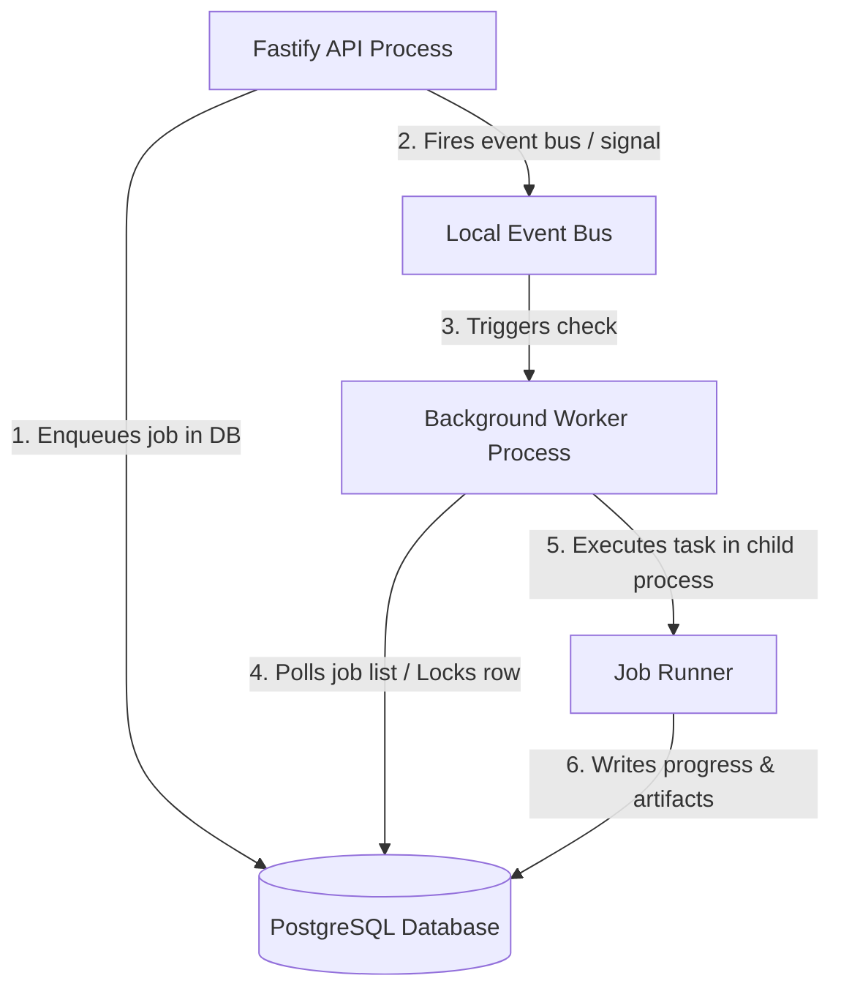

# MMS Background Job Worker Isolation Plan

## 1. Problem Statement
Currently, Madrasa Management System (MMS) processes background jobs (such as duplicate contact scans, CSV data exports, and synchronisation recoveries) in-process within the main Fastify API thread. 

Running heavy, CPU-bound or memory-intensive jobs on the main thread poses several risks:
- **Event Loop Blockage:** Processing large collections (e.g. 10k+ contacts) blocks the Node.js event loop, preventing the API from handling HTTP requests and degrading response times.
- **Memory Starvation:** Heavy memory allocation in jobs can trigger Out-Of-Memory (OOM) fatal crashes, bringing down the entire API server.
- **Zero Durability:** If the API process crashes or restarts, all active background jobs fail silently without recovery mechanisms.

---

## 2. Proposed Architecture
We propose isolating job executions into an out-of-process worker, using the PostgreSQL database as a queue.



---

## 3. Core Components

### A. PostgreSQL Queue Schema (`background_jobs` table)
We will add a schema to track job states, payloads, and artifacts:

```typescript
import { pgTable, text, integer, timestamp } from 'drizzle-orm/pg-core';

export const backgroundJobs = pgTable('background_jobs', {
  id: text('id').primaryKey(),
  tenantId: text('tenant_id').notNull(),
  userId: text('user_id').notNull(),
  kind: text('kind').notNull(), // 'contact_export' | 'dedup_scan' | 'sync_recovery'
  status: text('status').notNull().default('pending'), // 'pending' | 'running' | 'completed' | 'failed'
  payload: text('payload').notNull(), // JSON arguments
  progress: integer('progress').notNull().default(0), // 0 to 100
  artifactId: text('artifact_id'), // Reference to static file / download
  error: text('error'),
  createdAt: timestamp('created_at', { mode: 'date' }).notNull().defaultNow(),
  updatedAt: timestamp('updated_at', { mode: 'date' }).notNull().defaultNow(),
});
```

### B. Out-of-Process Worker
The background worker will run as a separate Node.js process:
1. **PM2 Process/Thread Separation:** In production, PM2 can run a main server process (`api.js`) and a worker process (`worker.js`).
2. **Mutex locking:** The worker uses a transaction with PostgreSQL `FOR UPDATE SKIP LOCKED` to lock and pick the next pending job atomically:
   ```sql
   WITH next_job AS (
     SELECT id FROM background_jobs
     WHERE status = 'pending'
     ORDER BY created_at ASC
     LIMIT 1
     FOR UPDATE SKIP LOCKED
   )
   UPDATE background_jobs
   SET status = 'running', updated_at = CURRENT_TIMESTAMP
   WHERE id = (SELECT id FROM next_job)
   RETURNING id;
   ```
3. **CPU isolation:** Worker tasks run in separate child processes (`child_process.fork`) or `worker_threads` to keep the main event loops completely free of blocking computations.

### C. Resilience and Recovery
- **Orphan Cleanup:** Upon startup, the worker scans for any jobs stuck in `running` status and transitions them to `failed` or schedules a retry, preventing locked files or processes.
- **Clean Shutdowns:** The worker listens to system SIGTERM/SIGINT signals to cleanly abort ongoing runs, update database states, and terminate child executors.
