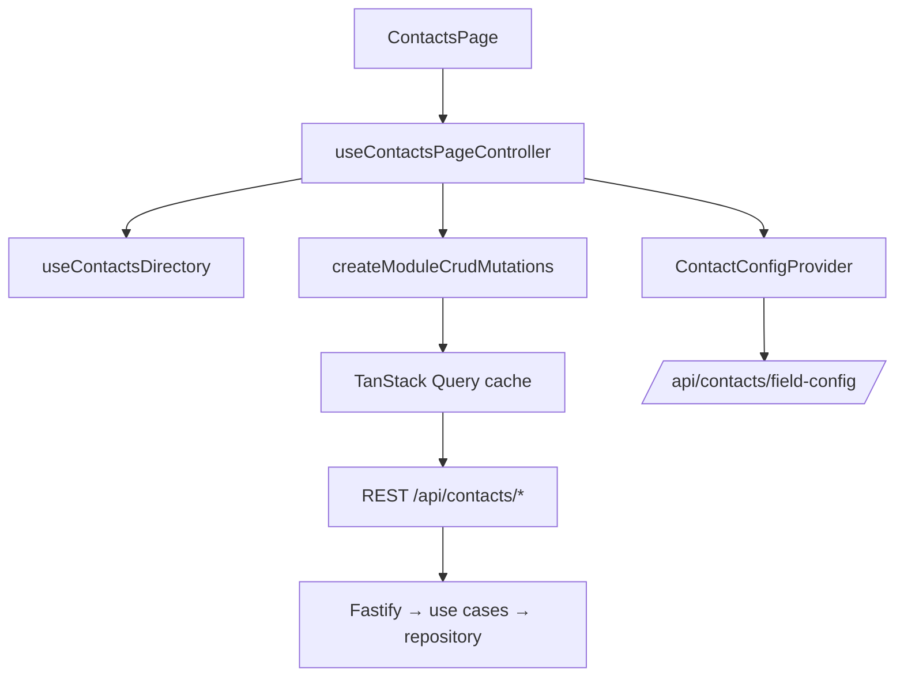

# MMS Contacts Module — Architectural Summary

## 1. Overview

The Contacts module has been refactored to enforce DRY (Don't Repeat Yourself) and SSOT (Single Source of Truth) across the stack:

- **Backend** — re-layered on Clean Architecture: domain types/logic in `@mms/shared`, orchestration in use cases, and a single repository interface as the sole storage gateway, with a Drizzle-backed adapter.
- **Frontend** — server state centralized through TanStack Query factories driven by the module manifest, and the UI rebuilt on reusable atomic primitives.
- **Shared** — one pair-finder, one set of key normalizers, one field/tab/column registry, one write-schema SSOT consumed by both apps.

The refactor also closed the "Contacts residual full loads" gap in the migration-status register: duplicate scan, identity match, and CSV/VCF export no longer hydrate the full active contact set into memory, and metrics/analytics/widgets run as SQL aggregates through the repository.

## 2. Backend — Clean Architecture Dependency Rule

The dependency rule is strict inward: **domain → use cases → repository interface → adapter/DB → routes/services**. Higher layers depend on interfaces, never on concrete storage.

```mermaid
graph TD
    ROUTES[Routes / services / background jobs] --> UC[Use cases]
    UC --> IFACE[ContactsRepository interface]
    IFACE --> ADAPTER[contactsRepositoryAdapter]
    ADAPTER --> DB[(PostgreSQL via Drizzle)]
    UC --> DOMAIN[@mms/shared domain]
    DB --> RLS[RLS + withTenantTransaction]
```

| Layer | Location | Responsibility |
|---|---|---|
| Domain | `packages/shared/src/contactTypes.ts`, `contactDuplicateUtils.ts`, `contactsDuplicatesQuery.ts`, `contactPreferenceDefaults.ts`, `contactDisplayUtils.ts` | Types, pair-finder semantics, key normalization, preferences defaults — no I/O |
| Use cases | `apps/backend/src/contacts/use-cases/contact{Load,LoadEntity,LoadAggregate,Write,SoftDelete,Normalize,UniqueField,RelationshipInference,IdentityMatch,DuplicateScan}UseCases.ts` | Orchestrate domain logic via the repository interface; resolve tenant via `getRequestTenant()` |
| Composition root | `apps/backend/src/contacts/use-cases/contactUseCases.ts` | `createContactsUseCases(repo)` binds a `ContactsRepository` to every use case; production default `contactUseCases` |
| Repository interface | `apps/backend/src/contacts/repository/contactsRepository.ts` | The single storage gateway |
| Adapter | `apps/backend/src/contacts/repository/contactsRepositoryAdapter.ts` | Delegates interface methods to the Drizzle repos |
| Storage | `apps/backend/src/db/repositories/contactRepository*.ts` | Drizzle query layer (`Core`, `List`, `Lookup`, `Widgets`, `Aggregates`, `Metrics`, `Duplicates`) |
| Entry points | `apps/backend/src/services/contactService.ts` (stable shim), routes, `backgroundJobRunnerService.ts` | Consume use cases |

The composition root is the DI seam:

```typescript
export function createContactsUseCases(repo: ContactsRepository = contactsRepository) {
  return {
    loadContactsPage: (query) => loadUseCases.loadContactsPage(query, repo),
    upsertContact: (contact, options) => writeUseCases.upsertContact(contact, options, repo),
    // ...
  };
}
```

Dependency-inversion highlights:

- `countContactDuplicateMatches`, `runContactsDuplicateScan`, and `loadDuplicatePairsPage` accept trailing `repo: ContactsRepository = contactsRepository` parameters, so tests inject a fake and callers stay unchanged. This is deliberate: `contactDuplicateScanService` (a service with real logic, not a thin shim) takes the repository interface directly so its load use-case dependents (`contactLoadEntityUseCases`, `contactLoadAggregateUseCases`, write/soft-delete) do not re-import the service through the composition root — that would re-create the load↔scan module cycle. The interface itself type-re-exports `ContactDuplicateCandidateKeys` / `ContactUniqueLookupValues` from the db layer so use cases never see the Drizzle layer; that direction is the intended SSOT flow.
- `contactGoogleSyncRun.ts` no longer touches Drizzle or the repository adapter directly — it routes through the `contactService.ts` shim (`loadExistingNormalizedContactNames`, `bulkSaveContacts`).
- The stable `contactService.ts` shim keeps routes and cross-module services (e.g. `usersService`, `teacherService`, `studentValidationService`) importing `loadContactsByIds`/`loadContactsPage` without a full migration, while new code imports `contactUseCases` directly.

## 3. SSOT — Single Source of Truth

SSOT holds at each concern boundary:

1. **Storage gateway.** `ContactsRepository` is the only interface for contact persistence and reads. Routes and use cases never reach the Drizzle layer directly.

2. **Duplicate semantics.** `findContactDuplicatePairs` in `packages/shared/src/contactDuplicateUtils.ts` is the pair-finder SSOT. `getContactDuplicateCandidateKeys` produces the normalized key space (phones / emails / name), and `buildNamePrefixRegex` (in `contactDisplayUtils.ts`) builds the anchored prefix-strip regex. The backend blocking query in `apps/backend/src/db/repositories/contactRepositoryDuplicates.ts` reuses `buildNamePrefixRegex` so the JS and SQL name-strip patterns cannot drift; the phone/email key extraction lives only in `getPhoneNumbers` / `getEmails` (shared `phoneUtils.ts` / `contactDisplayUtils.ts`), consumed by both the pair-finder and the candidate-key builder.

3. **Validation.** Shared Zod write schemas in `@mms/shared` are consumed by both the frontend forms and backend `parseRequest`; `prepareContactRecord` in `contactNormalizeUseCases.ts` applies the same normalization (E.164 phones, title-case names) on every write path.

4. **Module configuration.** `ContactConfigContext` (mounted once under `TenantScopedProviders`) is rebuilt on the generic `createStandardModuleConfigHook` — the same skeleton as Teachers/Students/Sessions/Users/Enrollments — with Contacts-specific lookups/column-layout layered on top. UI columns, tabs, and validation all derive from the one `fieldConfig`.

5. **Key/display formatting.** `composeContactName` (shared `contactLinkPolicy.ts`) and `formatContactPhoneFull` (frontend `contactPhoneDisplay.ts`) are each defined once and reused across detail views, lists, and exports; the duplicate-key normalizers (`getContactDuplicateCandidateKeys`, `buildNamePrefixRegex`) are the shared SSOT for comparison.

## 4. Frontend — Central Store + Atomic Design

Server state is centralized in TanStack Query factories; components do not issue direct `fetch`/HTTP calls. The page is assembled by an orchestrator hook that composes domain slices into view prop bags.



Key points:

- Query factories: `createModuleCrudMutations`, `createModuleQueryInvalidator`, `createModuleSetupConfigApi`, `createPersonModuleResolveQueries` — all keys derived from `CONTACTS_MODULE_MANIFEST`.
- The last raw HTTP call in the feature (`useAppleContactsPanel`) now runs through `useContactMutations` (`matchContactIdentity`), a Query mutation.
- `useContactsPageController.ts` composes directory, overlay, actions, messaging, and export slices into `tabPanelProps` / `overlayProps` — no repeated flatten→rebuild chains.
- Atomic design, low to high:
  - **Atoms** — `StatusBadge`, `WarningCallout`, `BulkSelectionBar`, `FieldErrorMessage` (`FormPrimitives.tsx`), `ModuleCommandMetricsGrid`, `FormField`.
  - **Molecules** — search/filter bar, `FieldErrorMessage` + input groupings.
  - **Organisms** — `ContactsWorkListBody`, detail sections (`ContactDetailPhonesSection`), form tabs.
  - **Templates/Pages** — the three-tier Work/Reports/Setup page, driven by the manifest.

## 5. DRY — Where Duplication Was Removed

- `createCollectionAuditHelper` — generic audit-trail factory extracted from repeated per-module audit code.
- `createModulePreferencesService` — generic preferences service shared across Contacts, Students, Teachers, Users, Sessions, Enrollments.
- `createStandardModuleConfigHook` — generic config hook now shared by all modules; Contacts' bespoke provider was rebuilt on it.
- `composeContactName` / `formatContactPhoneFull` — single formatting helpers instead of inline copies.
- Backend service split — one use case per concern (`Load` / `Write` / `SoftDelete` / `Normalize` / `UniqueField` / `RelationshipInference` / `IdentityMatch` / `DuplicateScan`) instead of one monolithic service; dead exports and orphaned shim functions removed.
- Shared-package dead-export closure — `@mms/shared` now exposes only production-consumed contact logic. The superseded JS full-set compute functions (command metrics, report analytics, widget aggregates) and the in-memory list pagination helper (`paginateContacts`) were removed after the SQL repos became the production truth; remaining self-use-only helpers were privatized (e.g. `collectParentIdsOf` / `collectChildIdsOf`, report-field catalog internals).
- Frontend — shared query/mutation factories replace per-component data plumbing; dead exports and translation keys pruned.

## 6. Async States, Testability, Accessibility

- **Async states** — a single state source (Query results + `ContactConfigContext`) drives loading / empty / error. Error surfaces use `ErrorState` with a hint description (`loadFailedHint` pattern); mutations await `mutateAsync` before closing forms.
- **Testability** — DI seams make use cases and the duplicate-scan service testable with fakes: `contactUseCases.test.ts` (composition root against an in-memory repo), `contactDuplicateScanService.test.ts` (SQL-scoped counting/blocking with a fake repo), `contactRepositoryDuplicates.test.ts` (mocked transaction), and shared pure-helper tests (`contactDuplicateUtils.test.ts`, `contactPhoneDisplay.test.ts`). Pure-helper coverage now also spans the field/column role gates (`contactFieldAccess.test.ts`, `contactColumnAccess.test.ts`), the identity-match Zod schemas (`contactIdentityMatch.test.ts`), saved-report permission/drill-down validation (`contactsSavedReportUtils.test.ts`), the nested item normalizers (`contactItemNormalizeRows.test.ts`), the sync outbox flush loop (`contactsSyncOutboxFlush.test.ts` in the frontend), and the Setup option seeds (`contactConfigSeeds.test.ts`).
- **Accessibility** — keyboard shortcuts (`useContactsKeyboardShortcuts`, Cmd+N), labeled inputs, focus management on overlays, and responsive/axe smoke checks per `mms-ui-ux-design.mdc`.

## 7. Trade-offs

These are accepted, documented decisions:

1. **Duplicate scan still scans the whole tenant in SQL.** A full pair compute is inherently tenant-wide, but the blocking query returns only participating ids — Node never hydrates the full active set. Scan progress became phase-based (start/finish) instead of per-page.
2. **Stable shim layer.** `contactService.ts` remains for backward compatibility. It costs an indirection; new code should import `contactUseCases` directly.
3. **SQL/JS key-normalization coupling.** The blocking query must stay in sync with `getContactDuplicateCandidateKeys`. This is mitigated by reusing `buildNamePrefixRegex` and the shared key builders (`getPhoneNumbers` / `getEmails`); the shared pair-finder remains the semantic authority.
4. **No single global frontend store.** Server state is Query-first plus the module-config context; purely local ephemeral UI state still lives in component state. This avoids a bespoke global store while keeping all server data in one cache.
5. **JS→SQL semantic parity via deletion.** The pre-SQL JS reference implementations (command metrics, report analytics, widget aggregates) were deleted, removing the only JS-level executable spec of those aggregate semantics. Accepted because the SQL repos are the production truth and `contacts.integration.test.ts` exercises `/metrics`, `/report-analytics`, and `/widget-aggregates` against the real DB. The shared query-shape types (`ContactsWidgetQuery`, `ContactsListQuery`, `ContactsListPageResult`) and the report-field predicate (`isContactsReportFieldId`) remain the FE/BE shape SSOT.

## 8. Acceptance-Criteria Mapping

- **No direct DB/HTTP calls from UI; all data via store/repository.** Satisfied by Query factories + `ContactConfigContext` (section 4) and the `ContactsRepository` gateway (section 3.1).
- **No duplicated contact logic (filtering, validation, formatting).** Satisfied by the shared normalizers, `composeContactName`/`formatContactPhoneFull`, and the shared Zod write schemas (sections 3, 5).
- **Consistent loading/empty/error states driven by a single state source.** Satisfied by Query-driven state + shared `ErrorState`/`StatusBadge` primitives (sections 4, 6).
- **Adding a status or field requires changes in minimal, well-defined places.** Satisfied by the field/tab/column registry in `@mms/shared` + module manifest + `buildNamePrefixRegex`-driven duplicate keys (sections 3, 5).

## 9. Migration-Status Closure Notes

Closed under "Contacts residual full loads":

- Duplicate scan — SQL blocking (`contactRepositoryDuplicates.ts`), no full active-set hydrate.
- Identity match — SQL candidate lookup via `findActiveContactsMatchingUniqueValues`.
- CSV / VCF export — SQL-paginated via `loadContactsPage` / `loadContactsByIds`.
- Metrics / report-analytics / widgets — SQL aggregates through the repository interface.
- List pagination — SQL-native via the `listPage` repository method; `contactsListQuerySchema` is the wire-shape SSOT. The shared in-memory `paginateContacts` helper was removed and the standards rules/skills refreshed accordingly (`sync-all.sh`).

Remaining (out of scope): niche chart dumps elsewhere in the app; `loadAllFn`/`maxPageSize` card dumps in other modules.

## 10. Certification

Monorepo final certification: `pnpm typecheck`, all three Vitest suites, and `pnpm lint` (frontend + backend) pass. Suite totals at certification: shared **788** tests (130 files), backend **686** tests (95 files), frontend **314** tests (67 files). The dead-reference re-scan found no orphaned references to the newly-tested or previously-privatized shared symbols; the previously-public `canEditContactField` was removed, along with the facade re-exports `fetchContactLookups`, `useContactsSavedReports`, and `useContactsSavedReportMutations`. The final gap wave also removed the dead shared helpers `isContactSystemFormField` / `listContactSystemFormFieldKeys` and `getDefaultFieldValue` / `getDefaultModuleFieldValue`, the unused frontend `contactsListQueryKey`, and the unexercised facade re-exports (`useContactsDuplicatePairs`, `fetchContactsPageForQuery`, `fetchContactById`, `contactDetailQueryKey`, `CONTACTS_REPORT_ANALYTICS_QUERY_KEY`). Messaging recipient reads now route through the Contacts composition root via `loadContactsPageForTenant` / `loadContactsByIdsForTenant` instead of the repository adapter.

