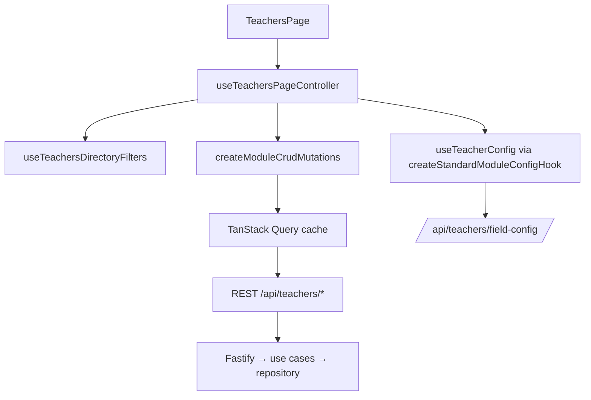

# MMS Teachers Module — Architectural Summary

## 1. Overview

The Teachers module has been refactored to achieve full architectural and visual parity with the Contacts gold standard, enforcing DRY (Don't Repeat Yourself) and SSOT (Single Source of Truth) across the stack:

- **Backend** — re-layered on Clean Architecture: domain types/logic in `@mms/shared`, orchestration in use cases, and a single repository interface as the sole storage gateway, with a Drizzle-backed adapter. The legacy `teacherService.ts` is a stable re-export shim over the composition root.
- **Frontend** — server state centralized through TanStack Query factories driven by the module manifest, and the UI rebuilt on reusable atomic primitives. No hardcoded colours/typography/spacing or ad-hoc chrome; no document-store (`getCollection`/`useLiveCollection`) access for the REST entity.
- **Shared** — one manifest, one write schema, one sanitizer, one list-query wire shape, one widget-aggregate contract, one registry-driven field/tab/column config consumed by both apps.

Contacts-domain features that do not apply to a contact-linked person module (duplicate detection/merge, Google/Apple sync, relationship/collection tabs, saved reports, VCF export) stay out of scope per the Students precedent.

## 2. Backend — Clean Architecture Dependency Rule

The dependency rule is strict inward: **domain → use cases → repository interface → adapter/DB → routes/services**. Higher layers depend on interfaces, never on concrete storage.

```mermaid
graph TD
    ROUTES[Routes / services / background jobs] --> UC[Use cases]
    UC --> IFACE[TeachersRepository interface]
    IFACE --> ADAPTER[teachersRepositoryAdapter]
    ADAPTER --> DB[(PostgreSQL via Drizzle)]
    UC --> DOMAIN[@mms/shared domain]
    DB --> RLS[RLS + withTenantTransaction]
```

| Layer | Location | Responsibility |
|---|---|---|
| Domain | `packages/shared/src/teacherTypes.ts`, `teacherValidation.ts`, `teacherResponseSanitizer.ts`, `teachersListQuery.ts`, `teachersWidgetAggregate.ts`, `teachersModuleManifest.ts`, `teacherEnabledTabs.ts`, `teacherColumnRegistrySync.ts` | Types, write/record schemas, viewer-role sanitization, list-query wire shape, widget aggregates, manifest — no I/O |
| Use cases | `apps/backend/src/teachers/use-cases/teacher{Load,LoadEntity,LoadAggregate,Write,SoftDelete,Normalize,Sanitize,Operation,Hydrate}UseCases.ts` | Orchestrate domain logic via the repository interface; resolve tenant via `getRequestTenant()` |
| Composition root | `apps/backend/src/teachers/use-cases/teacherUseCases.ts` | `createTeachersUseCases(repo)` binds a `TeachersRepository` to every use case; production default `teacherUseCases` |
| Repository interface | `apps/backend/src/teachers/repository/teachersRepository.ts` | The single storage gateway |
| Adapter | `apps/backend/src/teachers/repository/teachersRepositoryAdapter.ts` | Delegates interface methods to the Drizzle repos |
| Storage | `apps/backend/src/db/repositories/teacherRepository*.ts` | Drizzle query layer (`Core`, `List`, `ListQuery`, `ListOps`, `Widgets`, `FieldUsage`) |
| Entry points | `apps/backend/src/services/teacherService.ts` (stable shim), routes, `teacherConfigService`/`teacherValidationService`/`teachersExportService` | Consume use cases |

The composition root is the DI seam:

```typescript
export function createTeachersUseCases(repo: TeachersRepository = teachersRepository) {
  return {
    loadTeachersPage: (query) => load.loadTeachersPage(query, repo),
    createTeacher: (record) => write.createTeacher(record, repo),
    // ...
  };
}
```

Dependency-inversion highlights:

- `teacherService.ts` is a thin re-export shim destructuring the composition root (`teacherUseCases`), keeping the historical public import path stable for cross-module consumers (e.g. `teachersExportService`).
- `teacherHydrateUseCases.ts` routes through the Contacts composition root (`contactUseCases.loadContactsByIds`) for person-profile hydration — never raw Drizzle or the contacts adapter — so teacher rows hydrate name/phone/email/gender from the canonical Contacts record while `prepareTeacherRecord` strips contact-owned keys on write (`normalizeStoredTeacher` / `stripTeacherClientSoftDeleteFields`).
- Write and soft-delete use cases use `runInTransaction` (the shared tenant-RLS transaction helper, same as Contacts) for atomic broadcast + audit attribution.

## 3. SSOT — Single Source of Truth

SSOT holds at each concern boundary:

1. **Storage gateway.** `TeachersRepository` is the only interface for teacher persistence and reads. Routes and use cases never reach the Drizzle layer directly; the adapter is the only crossing point.

2. **Validation.** `teacherRecordSchema` in `@mms/shared` is the write SSOT, consumed by backend `parseRequest` on `POST /api/teachers` and the strict dynamic schema builder (`buildDynamicTeacherSchema`) for registry/custom fields; frontend forms validate against the same shape. `prepareTeacherRecord` in `teacherNormalizeUseCases.ts` applies the same normalization on every write path (client soft-delete strip → contact-profile strip → id resolution).

3. **Person identity.** Teacher rows store `contactId`; profile fields live on Contacts only — hydrate on read (`hydrateTeacherFromContact` / batch `loadContactsByIds`) and strip on write. The Work list SQL joins `contacts` for name search/sort (never teacher JSONB after strip).

4. **Module configuration.** `useTeacherConfig` is built on the shared `createStandardModuleConfigHook` — the same skeleton as Contacts/Students/Sessions/Users/Enrollments. UI columns, tabs, form fields, and validation all derive from the one typed `teacher_field_configs` + preferences (typed Setup REST, FORCE RLS). No hardcoded field/tab/column allowlists.

5. **Viewer-role sanitization.** `sanitizeTeacherForViewer`/`sanitizeTeachersForViewer` (`teacherResponseSanitizer.ts` + `teacherSanitizeUseCases.ts`) is the single read-path gate, driven by the field-config snapshot + viewer role — applied on list, single, create, update, restore, and `/resolve` responses.

6. **Wire shapes.** `teachersListQuerySchema` (list query), `teachersWidgetAggregate.ts` (widget queries/results), and `teacherRecordSchema` are the FE/BE contract SSOT — no per-app forks.

## 4. Frontend — Central Store + Atomic Design

Server state is centralized in TanStack Query factories; components do not issue direct HTTP calls. The page is assembled by an orchestrator hook that composes domain slices into a flat props bag.



Key points:

- Query factories: `createModulePaginatedListQuery`, `createModuleWidgetAggregatesQuery`, `createModuleCrudMutations`, `createModuleQueryInvalidator`, `createModuleSetupConfigHooks`, `createModuleLookupsHooks`, `createModuleSetupConfigApi`, `createPersonModuleResolveQueries` — all keys derived from `TEACHERS_MODULE_MANIFEST` + `teachersQueryKeys`.
- The last raw HTTP calls live at the query-builder/setup-api/lookups hook boundary only (`buildTeachersPageUrl`, `fetchTeacherById`, `useTeacherNextEmployeeId`, lookups) — the same pattern as Contacts' `contactsListQueryBuilders` / setup-api / lookups.
- `useTeachersPageController.ts` composes directory filters, mutations, column layout, export actions, keyboard shortcuts, and overlay/form state into the page shell's props — no repeated flatten→rebuild chains.
- Cross-module reads (e.g. linked contact in the detail model) import through the `@/tenant/hooks/collections/contacts` facade — never feature→feature deep imports.
- Atomic design, low to high:
  - **Atoms** — `StatusBadge`, `WarningCallout`, `Button`, `Checkbox`, `Input`, `UserAvatar`, `ModuleCommandMetricsGrid`, `FieldErrorMessage`.
  - **Molecules** — `ModuleRowActionsMenu`, `ModuleTableHeaderCell`, `ModuleTableFooterCount`, `ModuleWorkBulkActionBar`, `BulkSelectionStatusAction`, `ModuleFiltersMenuButton`, `SearchBar`, `ModuleWorkDirectoryEmpty`, `PersonDetailHeroCard`, `EntityMessagingDropdownItems`, `DetailDrawerShell`, `FormModal`.
  - **Organisms** — `TeachersWorkTier`/`TeacherListTable`/`TeacherListCards`, detail drawer sections (`TeacherDetailHero`, `TeacherDetailAttributeRow`, `TeacherDetailNotesSection`), form tab sections, `TeachersSettings` (SubTabBar: fields/preferences/lookups).
  - **Templates/Pages** — the three-tier Work/Reports/Setup page driven by the manifest.

State parity with Contacts: the Work tier routes skeleton/error/empty through `ModuleWorkListStateShell` (ErrorState + `teachers.loadFailed`/`teachers.loadFailedHint` + retry + pagination), directory empties through `ModuleWorkDirectoryEmpty`, and exposes `aria-busy` + an `sr-only` polite live region; keyboard shortcuts include Cmd/Ctrl+N create. Detail drawer archive state uses `WarningCallout` (`EntityArchivedBanner`) + Restore with messaging/quick-actions hidden when deleted.

## 5. DRY — Where Duplication Was Removed

- `createCollectionAuditHelper` — `auditTeacher` reuses the generic audit-trail factory (same as `auditContact`).
- `createModulePreferencesService` / `createModuleStringListLookupsService` / `createModuleFieldConfigService` — typed Setup services shared across modules; `teacherConfigService` is a wrapper, not a fork.
- `createStandardModuleConfigHook` — Teachers config is built on the generic hook (no bespoke provider).
- Shared Work chrome — `ModuleTableHeaderCell`, `ModuleTableFooterCount`, `ModuleRowActionsMenu` (+ `EntityMessagingDropdownItems`), `ModuleWorkBulkActionBar` (+ `BulkSelectionStatusAction`), `ModuleWorkListStateShell`, `ModuleWorkDirectoryEmpty`, `ModuleFiltersMenuButton`, `WorkViewModeToggle`, `ModuleColumnCustomizer`, `ModuleTrashToggle`, `WORK_SURFACE`/`WORK_STICKY_HEAD`/`workTableStickyCellBg` — no per-module forks of selection bars, empties, KPI strips, or table chrome.
- Detail/form parity — `PersonDetailHeroCard`, `DetailDrawerShell`, `DetailDrawerRestoreOrEditAction`, `EntityArchivedBanner`, `DetailSectionTitle`, `FormFooterChip`, `LeadingIconInput`, `StatusBadge` — reused directly.
- Backend service split — one use case per concern (`Load`/`Write`/`SoftDelete`/`Normalize`/`Sanitize`/`Operation`/`Hydrate`) instead of one monolithic service; `teacherService.ts` stays as a stable shim.

## 6. Async States, Testability, Accessibility

- **Async states** — a single state source (Query results + `useTeacherConfig`) drives loading/empty/error. Error surfaces use `ErrorState` with a hint description (`teachers.loadFailedHint`); mutations await `mutateAsync` before closing forms; Setup Save is dirty-gated.
- **Testability** — DI seams make use cases testable with fakes: `teacherUseCases.test.ts` (composition root against an in-memory fake `TeachersRepository`), `teacherNormalizeUseCases.test.ts` (prepare/normalize), backend `inject()` route tests (`teachersSoftDelete.integration.test.ts`, `teachersWriteSsot.integration.test.ts`), SQL SSOT tests (`teacherContactSqlSsot.test.ts`, `teacherRepositoryListContactSsot.test.ts`, `teacherRepositoryBulkStatus.test.ts`), shared pure-helper tests (`teacherResponseSanitizer.test.ts`, `teacherUtils` — avatar hydrate/strip, `teacherValidation`, `teacherSetupConfigTypes`, `teachersListQuery`, `teacherColumnRegistrySync`, `teacherEnabledTabs`, `teacherDirectoryColumns`, `teacherLookupTypes`, `teachersWidgetAggregate`, `teachersExportUtils`, `teacherFormCustomFields`, `teacherFieldCellFormat`), and FE tests (`teachersListQueryBuilders.test.ts`, `teachersSelectionTargets.test.ts`).
- **Accessibility** — keyboard shortcuts (`useTeachersKeyboardShortcuts`, Cmd+N), labeled inputs/checkboxes, `aria-busy` + polite live region on the Work directory, focus-managed overlays, and shared primitives keep the 44px touch floor (`min-h-11`).

## 7. Trade-offs

These are accepted, documented decisions:

1. **Stable shim layer.** `teacherService.ts` remains for backward compatibility (cross-module import paths + backup/restore surface). It costs an indirection; new code imports `teacherUseCases` directly.
2. **Consolidated FE hook shape.** Teachers uses `useTeachersPageActions` (Students-shaped) instead of Contacts' split `useContactsCrudActions`/`WriteActions`/`DeleteActions`. This is the accepted Students parity shape and keeps page orchestration in one controller.
3. **No single global frontend store.** Server state is Query-first plus the module-config context; local ephemeral UI state lives in component state. This avoids a bespoke global store while keeping all server data in one cache.
4. **Contacts-domain features out of scope.** Duplicate detection/merge, Google/Apple sync, relationship/collection tabs, saved reports, and VCF export are Contacts-only; Teachers is a contact-linked person module like Students and inherits the same boundary.

## 8. Acceptance-Criteria Mapping

- **No direct DB/HTTP calls from UI; all data via store/repository.** Satisfied by Query factories + `useTeacherConfig` (section 4) and the `TeachersRepository` gateway (sections 2, 3).
- **No duplicated teacher logic (filtering, validation, formatting).** Satisfied by the shared `teacherRecordSchema` / `teachersListQuerySchema` / `teachersWidgetAggregate`, `resolveTeacherPrimaryChannels`, and the shared `computeModuleMessagingSelectionTargets` wrapper (`teachersSelectionTargets.ts`).
- **Consistent loading/empty/error states driven by a single state source.** Satisfied by Query-driven state + shared `ModuleWorkListStateShell` / `ModuleWorkDirectoryEmpty` / `ErrorState` primitives (sections 4, 6).
- **Adding a status or field requires changes in minimal, well-defined places.** Satisfied by the field/tab/column registry + module manifest + typed Setup REST (sections 3, 5).
- **Design-token SSOT.** Teachers imports colours/typography/spacing/shadow strictly from the centralized `@theme` tokens and `formStyles` — no hardcoded hex/arbitrary Tailwind values in the feature (audit clean).

## 9. Migration-Status Closure Notes

- Teachers Work list pagination is SQL-native via `listTeachersPage` (`teacherRepositoryListQuery.ts`): typed `deleted_at` filter, contact-join name search/sort, status/specialization filters, `LIMIT/OFFSET` + `hasMore`. No unpaged `loadAllFn`/`maxPageSize` dumps.
- Metrics (`aggregateTeachersCommandMetrics`), widget aggregates (`aggregateTeachersWidgetQueries`), and bulk status (`bulkUpdateTeachersStatusSql`) are SQL aggregates through the repository interface — no full-collection hydration in Node.
- Typed Setup (field-config, preferences, lookups, column prefs) is FORCE-RLS REST — not document-store. `teachers` entity is absent from `ALLOWED_COLLECTIONS`/`BUSINESS_COLLECTIONS` (no ghost-write path).
- Live push: `teacherUseCases` broadcasts `teachers` via `broadcastCollection`; the FE subscribes through the tenant `/api/ws` channel → `invalidateTeachersQueries`.

## 10. Certification

Monorepo final certification for this sweep: `pnpm typecheck`, all three Vitest suites, and `pnpm lint` (frontend + backend) pass. Suite totals at certification: shared **790** tests (130 files), backend **722** tests (97 files), frontend **327** tests (69 files).

The parity sweep audited both requested axes against the Contacts gold standard:

- **UI/UX & design system** — token SSOT clean (no hardcoded styling); every interactive/molecule surface composes shared Atoms/Molecules (`ModuleTableHeaderCell`, `ModuleTableFooterCount`, `ModuleRowActionsMenu`, `ModuleWorkBulkActionBar`, `PersonDetailHeroCard`, `EntityMessagingDropdownItems`, `DetailDrawerShell`, `FormModal`, `ModuleFiltersMenuButton`, …); skeleton/empty/error/`aria-busy` state parity confirmed across Work, detail drawer, form, Setup, and Reports.
- **System architecture** — Entities → Use Cases → Repository interface → Adapter → UI holds on the backend; the FE data layer is centralized in shared Query factories with HTTP confined to the query-builder boundary; cross-module reads go through the collections facade.

Gaps closed during the sweep: the missing `teachersSelectionTargets.test.ts` unit test (Contacts parity) was added.

Gaps closed during the follow-up sweep:

- **Avatar parity.** Contacts/Students render the canonical person avatar in the detail hero, table row, and card header; Teachers rendered initials everywhere. The linked-Contact avatar is now hydrated (`hydrateTeacherFromContact` copies it teacher-specifically — shared `hydrateContactProfile` is unchanged so Students' own avatar is untouched) and threaded through `TeacherDetailHero` (with the `linkedContact` fallback from the detail model), the `TeacherListTable` row `UserAvatar`, and `TeacherCardHeader`'s `DirectoryCardHeader`. The write path strips a hydrated avatar (`stripTeacherWriteNoise` → `delete avatar`), so it can never dual-write onto the teacher row through the `.catchall` wire schema or the `.strict()` form schema. New shared unit tests cover both the hydrate-copy and the write-strip.
- **Dead-export prune.** `useTeacherById` (and its `fetchTeacherById` chain) had zero consumers anywhere, yet was re-exported from both the feature barrel and the cross-module collections facade — the same dead-surface the Contacts cleanup wave removed. The unexercised re-exports were pruned from `useTeachers.ts` and `collections/teachers.ts`; the hook itself and its existing unit test stay intact.
